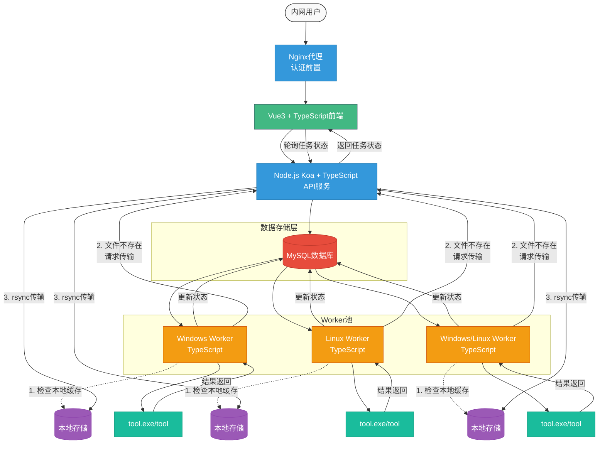

# IPA包代码相似度检测平台

## 一、产品概述

本系统是一个面向iOS开发团队的IPA包代码相似度检测平台，支持内网用户异步提交两个IPA包进行对比分析，通过Windows/Linux机器执行二进制检测工具返回结果，提供任务状态追踪和检测结果展示功能。系统采用分布式架构，基于TypeScript全栈开发，确保高效处理和可靠性。

## 二、核心功能清单

| 功能维度 | 子功能描述 | 技术保障 |
|---------|-----------|---------|
| 任务提交 | IPA文件上传/校验/提交 | 200MB文件支持，分块上传 |
| 任务调度 | 跨平台任务分配机制 | MySQL状态机驱动，去中心化设计 |
| 任务追踪 | 状态实时更新 | 前端轮询，实时反馈 |
| 结果展示 | 相似度评分展示 | 进度条可视化，多级评分标准 |
| 异常处理 | 文件格式校验/超时控制 | 多级防护策略，自动重试机制 |
| 文件分发 | 智能文件传输 | rsync高效传输，本地缓存优化 |

## 三、系统架构



## 四、技术选型说明

### 基础技术栈

| 组件 | 选型 | 理由 |
|------|------|------|
| 开发语言 | TypeScript | 类型安全，代码可维护性高，全栈统一语言 |
| 前端框架 | Vue3 + TypeScript | 响应式设计，组件化开发，高性能渲染 |
| UI组件库 | Element Plus | 丰富的组件库，适合企业级应用 |
| 后端框架 | Koa2 + TypeScript | 轻量级Node.js框架，中间件架构灵活 |
| 异步处理 | Async/Await | 代码可读性强，异步流程清晰 |
| 任务队列 | MySQL + 状态机 | 零运维成本，高可靠性 |
| 文件传输 | rsync | 高效增量传输，跨平台支持 |
| 状态管理 | Vuex + TypeScript | 集中式状态管理，类型安全 |

### 扩展依赖

| 模块 | 说明 | 版本要求 |
|------|------|---------|
| multer | 文件上传中间件 | 1.4.5+ |
| mysql2 | 数据库驱动 | 3.5.0+ |
| pm2 | 进程管理 | 5.3.0+ |
| compression | GZIP压缩 | 1.7.4+ |
| axios | HTTP客户端 | 1.4.0+ |
| fs-extra | 文件系统扩展 | 11.1.1+ |
| uuid | 唯一ID生成 | 9.0.0+ |
| node-rsync | rsync封装 | 0.6.1+ |
| ts-node | TypeScript运行环境 | 10.9.1+ |
| typescript | TypeScript编译器 | 5.0.0+ |

## 五、数据库设计 (MySQL)

```sql
CREATE TABLE tasks (
  id INT AUTO_INCREMENT PRIMARY KEY,

  -- 文件元数据
  task_id CHAR(36) NOT NULL,
  file1_name VARCHAR(255) NOT NULL,
  file2_name VARCHAR(255) NOT NULL,
  storage_path VARCHAR(512) NOT NULL,

  -- 任务状态
  status ENUM('pending','processing','completed','failed') DEFAULT 'pending',
  similarity_score FLOAT NULL DEFAULT NULL,
  created_at TIMESTAMP DEFAULT CURRENT_TIMESTAMP,
  updated_at TIMESTAMP DEFAULT CURRENT_TIMESTAMP ON UPDATE CURRENT_TIMESTAMP,

  -- 节点信息
  worker_id VARCHAR(64) NULL DEFAULT NULL,
  worker_ip VARCHAR(45) NULL DEFAULT NULL,
  expire_at TIMESTAMP NULL DEFAULT NULL,

  -- 索引优化
  INDEX (status),
  INDEX (task_id)
);
```

### 字段说明

- **task_id**: 任务唯一标识符，使用UUID格式
- **file1_name/file2_name**: 上传的IPA文件名
- **storage_path**: 文件存储路径
- **status**: 任务状态（待处理、处理中、已完成、失败）
- **similarity_score**: 相似度评分结果（0-1之间的浮点数）
- **worker_id**: 处理该任务的Worker节点ID
- **worker_ip**: Worker节点IP地址，用于文件传输
- **expire_at**: 任务处理超时时间

## 六、服务部署方案

### 1. 物理部署拓扑

```
[内网用户]
└──> Nginx代理 (认证前置)
    └──> Koa Web服务器 (Linux)
        ├──> MySQL任务队列
        └──> API服务
            ├── Windows Worker节点1
            ├── Linux Worker节点2
            └── Windows/Linux Worker节点N
```

### 2. 组件部署要求

#### Koa API服务

- **配置文件**: `config/app.yaml`
- **静态资源**: `public/uploads`
- **启动命令**: `npx ts-node server.ts --port 8080 --env production`
- **推荐规格**: 4核8G，SSD存储
- **扩展方式**: 水平扩展，Nginx负载均衡
- **文件存储**: 本地存储，通过rsync分发

#### Worker服务

```bash
# Windows启动示例
SET LOCAL_STORAGE=D:\ipa_storage
npx ts-node worker.ts --id=worker-01 --max-concurrent=2 --ip=192.168.1.100

# Linux启动示例
LOCAL_STORAGE=/opt/ipa_storage npx ts-node worker.ts --id=worker-02 --max-concurrent=4 --ip=192.168.1.101
```

- **推荐规格**: 8核16G，Windows/Linux系统
- **扩展方式**: 增加Worker节点数量
- **注意事项**: 确保tool.exe/tool工具在PATH中可用
- **本地存储**: 配置足够的本地磁盘空间用于缓存IPA文件

#### rsync配置

```bash
# Linux服务器安装
apt-get install rsync

# Windows服务器安装
# 使用cwRsync或Windows Subsystem for Linux (WSL)
```

- **存储容量**: 建议每个节点500GB以上，可扩展
- **缓存策略**: LRU缓存策略，定期清理过期文件

## 七、安全设计

### 前置认证

- 通过Nginx实现JWT/OAuth2代理认证
- API服务信任X-Forwarded-User头
- 支持多种认证方式（LDAP、SSO）

### 文件安全

- 自动校验IPA包签名有效性
- 文件存储路径随机化：`/storage/ipa/<uuid4>/`
- 临时文件生命周期控制（默认3天）
- 文件访问权限控制
- rsync传输使用SSH隧道加密

### 通信安全

- HTTPS强制加密
- 任务ID生成：uuidv4()确保唯一性
- 上传文件防篡改：SHA256摘要验证
- 内网部署，物理隔离
- Worker节点IP白名单机制

## 八、文件传输机制

### 智能文件分发流程

1. **本地缓存检查**
   - Worker接收任务后，首先检查本地存储中是否已有所需IPA文件
   - 通过文件路径和SHA256哈希值验证文件完整性

2. **文件请求**
   - 若本地无文件或文件校验失败，Worker向API服务发送文件请求
   - 请求包含Worker IP地址、任务ID和所需文件信息

3. **rsync传输**
   - API服务收到请求后，使用rsync将文件传输到Worker节点
   - 对于Windows节点，使用cwRsync或WSL中的rsync
   - 对于Linux节点，直接使用原生rsync

4. **增量传输优化**
   - 利用rsync的增量传输特性，减少网络带宽占用
   - 支持断点续传，提高大文件传输可靠性

5. **传输完成确认**
   - 文件传输完成后，Worker再次校验文件完整性
   - 确认无误后开始执行检测任务

### 跨平台兼容性

- **Windows兼容性**
  - 使用cwRsync或WSL提供rsync功能
  - 路径转换处理（反斜杠/正斜杠）
  - PowerShell脚本封装rsync命令

- **Linux兼容性**
  - 使用原生rsync命令
  - 权限管理和用户映射

## 九、未来扩展方向

- **容器化部署**: 支持Docker/Kubernetes部署方案
- **代码分析增强**: 增加细粒度代码差异分析
- **可视化升级**: 实现检测结果图表化展示
- **API文档**: 开发RESTful API文档中心
- **多语言支持**: 扩展对Android APK的支持
- **机器学习**: 引入ML模型优化相似度算法
- **分布式缓存**: 引入Redis优化文件元数据缓存
- **WebAssembly**: 前端引入WASM优化性能

## 十、技术方案亮点

### 去中心化任务调度

- 通过MySQL实现的无第三方依赖任务调度
- Worker直接从数据库获取任务，减少单点故障
- 任务状态机驱动，自动处理异常情况

### 智能文件分发

- 本地缓存优先，减少重复传输
- rsync增量传输，节省带宽资源
- 跨平台文件传输解决方案
- 文件完整性校验机制

### 跨平台兼容

- TypeScript全栈开发，代码复用
- 统一的文件路径处理
- Windows/Linux双平台支持
- 检测工具跨平台封装

### 资源隔离

- 每个任务独立存储目录
- Worker进程独立运行实例
- 任务超时自动回收机制

### 可观测性

- Prometheus监控指标暴露
- 每日任务量统计接口
- 详细的日志记录和错误追踪
- Worker负载均衡策略

### 高效文件处理

- 大文件分块上传支持
- 文件格式自动校验
- 文件哈希计算与验证
- 临时文件自动清理机制
- 本地缓存LRU淘汰策略
